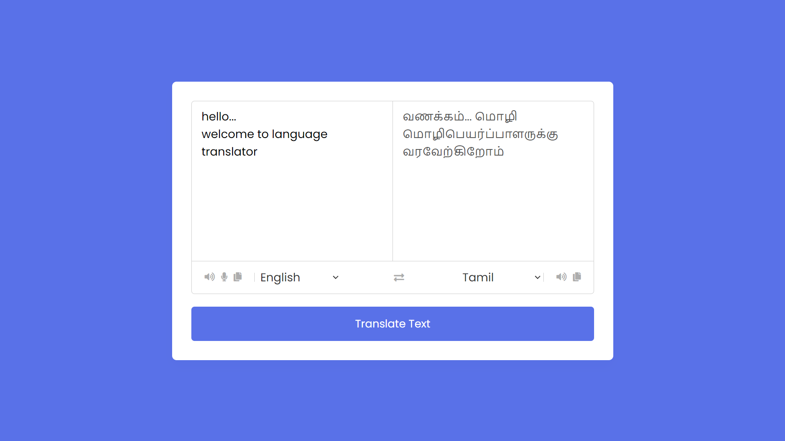

# Language Translation Web Application

## Objective
A web application that gets text or voice input from the user and translates it to the designated language. Built using HTML, CSS, and JavaScript, it provides features like text translation, text-to-speech, speech-to-text integration, and copying text to the clipboard.

## Key Features
1. Text Translation: Translate text from a source language to a target language.
2. Speech Integration: Convert spoken words to text and translate.
3. Audio Playback: Use text-to-speech to play translated text.
4. Copy to Clipboard: Easily copy the translated text or the original text to the clipboard.
5. Language Selection: Choose source and target languages from a dropdown menu.

## Getting Started
### Tech Stack
1. HTML: Structure of the web page.
2. CSS: Styling of the application.
3. JavaScript: Interactivity and functionality, including API calls and speech recognition.

### How to use the application?
* Navigate to the page [Language Translator](https://nagasudharshan-k.github.io/language_translator/).
* Type the text you want to translate into the source text area. (or)
* Click the microphone icon to input text using speech recognition.
* Choose the source and target languages from the dropdown menus.
* Click the "Translate Text" button to perform the translation.
* Click the speaker icon to hear the text read aloud.
* Click the copy icon to copy the text to your clipboard.

## Live link
* [Language Translator](https://nagasudharshan-k.github.io/language_translator/)
* Hosted using GitHub.

